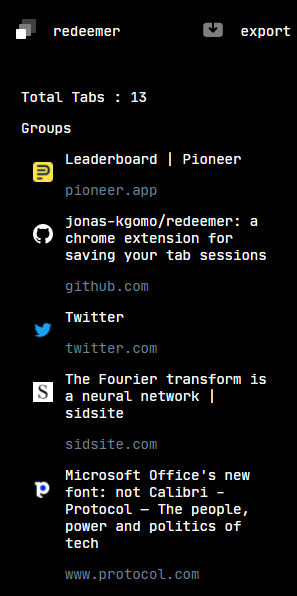

### Redeemer

> A chrome extension for saving your tab sessions

How to load this extension: 
1. Open the Extension Management page by navigating to `chrome://extensions`.
   - Alternatively, open this page by clicking on the Extensions menu button and selecting Manage Extensions at the bottom of the menu.
   - Alternatively, open this page by clicking on the Chrome menu, hovering over More Tools then selecting Extensions
2. Enable Developer Mode by clicking the toggle switch next to Developer mode.
3. Click the Load unpacked button and select the extension directory.

TODO

1. Shorten links with www.
2. Tab groups
3. Archive 
4. Download